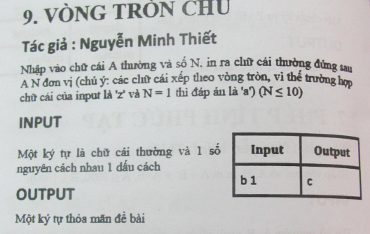

## Đề bài

## Cách làm:
### Vòng tròn chữ -> theo bảng chữ cái tiếng anh: 
    a -> z

### Thế còn chữa viết hoa thì sao?
    TL: Hiện đề bài đang muốn chỉ dùng chữ thường thôi.

### Có thể dùng bảng mã ascii:
